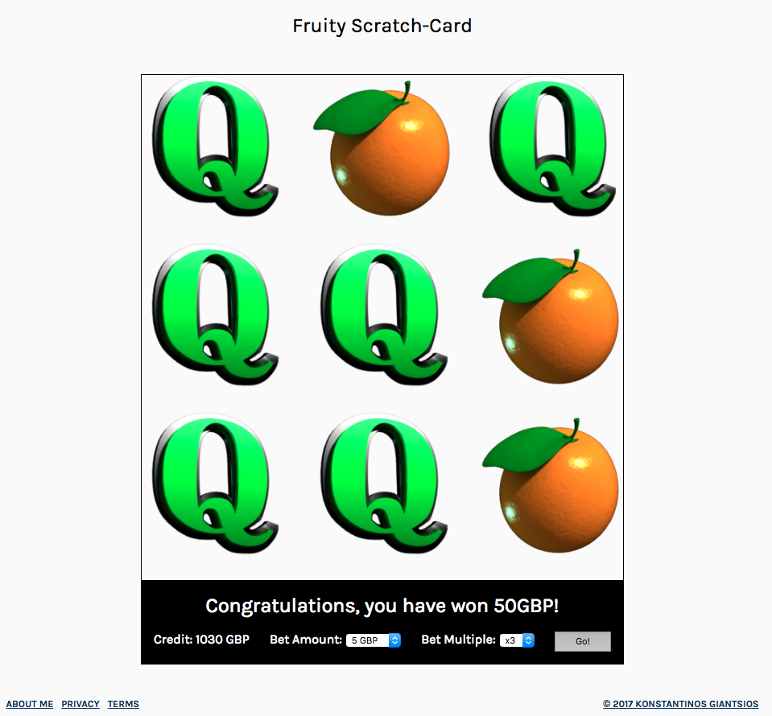

# **PROJECT 1: BUILD A GAME IN THE BROWSER**
### Web Development Immersive #31, General Assembly, London UK

##About
This project is the first completed in the context of my participation in the WDI GA course in London. My initial choise of game was actually a business quiz that aimed to utilize Google Charts and SurveyJS to test player knowledge on a variety of economic and business topics. For someone that started to learn coding just 3 weeks ago that proved to be an over-ambitious pursuit, and 2 days before the project deadline was dropped and this scratch game was developed in less than half the initially allocated time.
##Description
Fruity Scratch-Card is a betting scratch game  developed using HTML/CSS, JQuery and Javascript. This time I chose to focus primarily on the game logic and functionality, and less on the visual excellence, given the time pressure. You can play the game [here](https://kg-firstapp.herokuapp.com/). 

**Game logic:** The aim of of the player is to select 3 identical images from the image grid to win. A winner of a round is then offered the option to double down on its bet by having another try using the just won amount as bet amount. If again succesful the game will return doubeole the winnings of a normal game round. For example, a player bets 10GBP and wins 150GBP (with the 7s which have a win multiple of 15). If s/he choses to participate in the second level, the game will use as bet amount the 150GBP won in the previous round and if say wins agains with the 7s multiple of 15, the total take home amount will be [150 * 15 (the normal return) * 2 (the double down level 2 add-on)] = 4500GBP.

The probability of a win can be configured by changing the number of images available. At the time of this release only two of the total 7 different images are activated.

Further, each image/card carries a different weight/multiplier. For example, in the release onfiguration "Oranges"  carry a multiple of 5 while the "7s" carry a multiple of 15.

**How to play**: The game play attends the following sequence:
* review the available credits
* select the amount to bet
* select multiples if you want to pick a bet amount that cannot be provided from the previous drop down menu. This feature was put in place for use in a third level of betting features but was not utilised so in this release.
* click 'go' button to start the game
* select 3 windows
* if the images are not the same, the game ends
* if the images are the same the player has the option to harvest the winnings and end the game here or go for the big win and play another, final round, repeating the above sequence.  

**Credits:** Big thank you to our educators Gerry, Emily, Guy and Benfor for their effort, support and making it fun.

